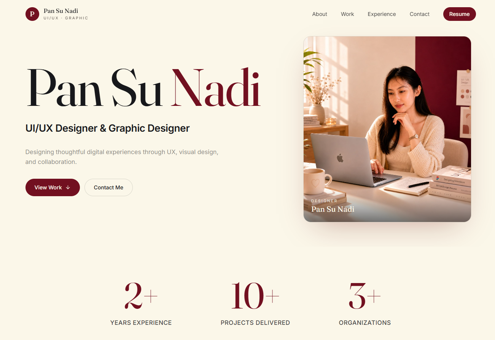

# Pan Su Nadi — Portfolio

A personal portfolio website showcasing my work as a UI/UX Designer and Graphic Designer.

The website focuses on presenting selected case studies, design process, and creative work through a clean and modern digital experience.

## 🚀 Live Website

https://portfolio-pan-su.vercel.app/

---

## ✨ Features

- Responsive portfolio website
- Project case studies with detailed design process
- Modern UI with smooth animations
- Optimized image assets
- SEO-friendly metadata
- Social media sharing preview support
- Clean component-based architecture

---

## 🛠 Tech Stack

### Frontend

- React 19
- TypeScript
- Vite
- TanStack Router
- Tailwind CSS
- shadcn/ui
- Framer Motion

### Tools & Libraries

- Lucide React (Icons)
- React Query
- Zod
- ESLint
- Prettier

---

## 📂 Project Structure

```
src
├── assets              # Images and static assets
├── components
│   ├── site            # Portfolio-specific components
│   └── ui              # Reusable UI components
├── hooks               # Custom React hooks
├── lib                 # Utility functions and project data
├── routes              # Application routes
├── router.tsx          # Router configuration
├── start.ts            # Application startup configuration
└── styles.css          # Global styles
```

## 🎨 Design

This portfolio was designed with a focus on:

- Clear visual hierarchy
- User-friendly navigation
- Storytelling through case studies
- Minimal and modern aesthetics
- Responsive experience across devices

## 📸 Portfolio Sections

The website includes:

- Hero introduction
- About section
- Design skills
- Selected projects
- Case studies
- Graphics Works
- Contact section

## 📄 License

This project is created for personal portfolio purposes.

All design work, images, and content belong to Pan Su Nadi unless stated otherwise.


